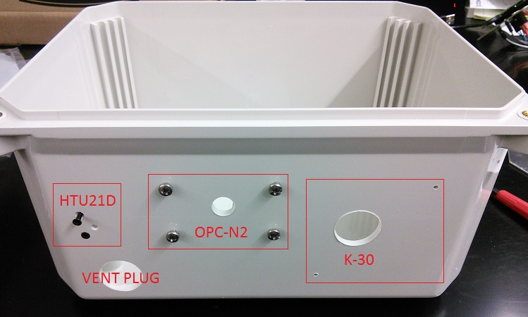
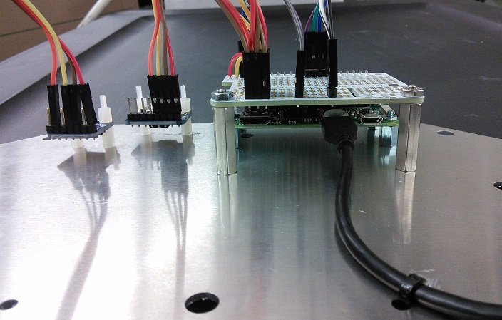
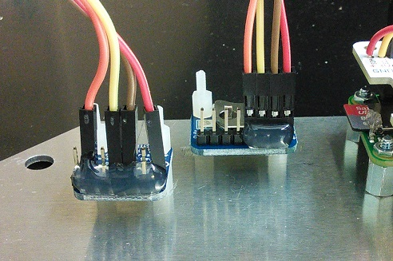
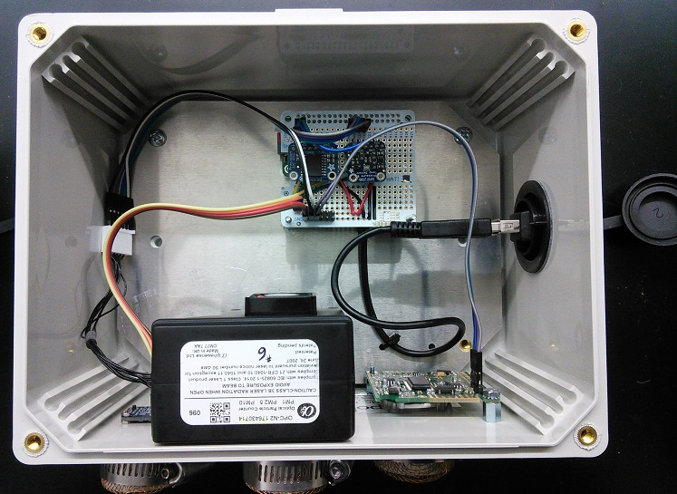
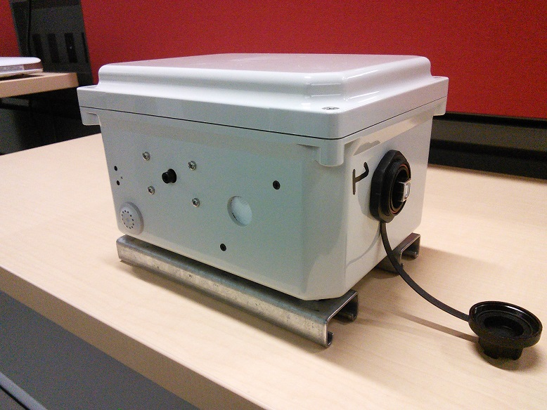
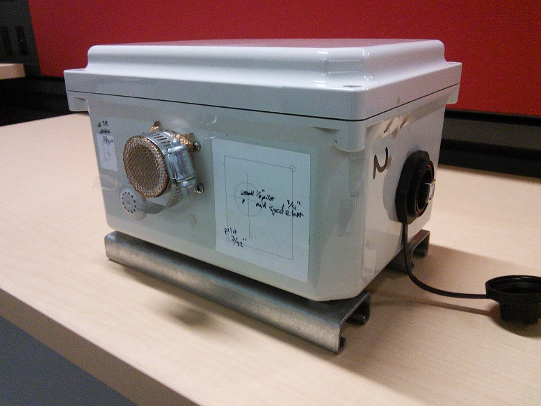

# Assembly notes

### Urbanova Air Quality Network Sensor Prototype

Some construction and build notes for the deployed prototypes.

## Wiring

We recommend having all hardware connected directly to the Raspberry Pi, 
including power connectors. An expansion board like [this one](https://www.adafruit.com/product/2314)
or [this one](https://www.adafruit.com/product/3203) will greatly simplify 
connecting devices to the I2C bus and power pins. 

> *Through trial-and-error, we determined the Alphasense OPC-N2 aerosol sensor
> exhibits high sensitivity to input voltage and ground differentials between
> its data and power lines. To avoid the dreaded "your firmware could not be 
> detected" error, connect power input and power ground lines directly to the
> Pi Zero's 5V and G rails, respectively.* 
> 
> *The Pi can source up to 1.5A through its GPIO pins, which is sufficient to
> support the OPC-N2 start-up current requirements. Of course, you should use a 
> high quality power supply that can source at least 2A.*

Diagram of wiring connections (open images with [Draw.io](https://www.draw.io/) 
to edit, export as PNG with "include a copy.." to save):

### Pi 0

### Pi 3

## CAD Drawings

To-scale CAD drawings of environmental sensors for positioning enclosure 
cut-outs and mounting holes. PDFs sized for Letter paper.

* CO2 sensor (K30): [.dxf](diagrams/panel-layout_K30.dxf), [.pdf](diagrams/panel-template_K30.pdf)
* PM sensor (OPC-N2): [.dxf](diagrams/panel-layout_OPC-N2.dxf), [.pdf](diagrams/panel-template_OPC-N2.pdf)
* T/RH sensor (HTU21D): [.dxf](diagrams/panel-layout_HTU21DF.dxf), [.pdf](diagrams/panel-template_HTU21DF.pdf)
* P/T sensor (BMP280): *n/a, mounted inside enclosure*

## Next-gen Unit Construction

> ***Fix me***

## Prototype Construction

Sensors are exposed to ambient conditions through holes in the bottom of the 
enclosure. See *CAD Drawings* above for printable position templates. 

> *The pressure/temperature sensor is located entirely within the enclosure. It
> still represents barometric pressure as the box is not air-tight, but the
> temperature measurement does not reflect ambient conditions.*

Rudimentary weatherproofing of the T/RH sensor (HTU21D) is done with hot glue:

The aerosol sensor (OPC-N2) has a foam gasket for weather resistance; secure it
using M3 screws (try 5mm length). The CO2 sensor (K30) fits snugly to the 
enclosure on #4-40, 5/16" tall stand-offs:

Raspberry Pi, pressure/temperature sensor (BMP280) and real-time clock (RTC)
(DS3231) are mounted to the rear panel:

Keep those connectors (all of them!) in place with hot glue:

You can improvise stand-offs of any size using long bolts and hex nuts. This
photo also shows a more compact Pi Hat layout with clock and P/T sensor
directly mounted.

The inside of an assembled package looks like this:

And the three prototype units looked like this during their initial bench tests
on the Paccar roof Dec 2016-Jan 2017.

