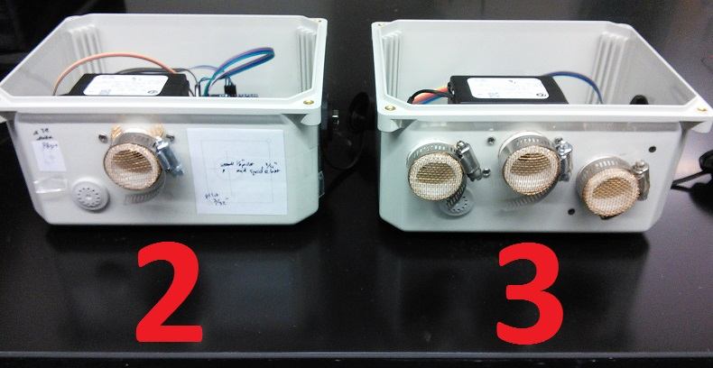

# Bench Test #1

### Urbanova Air Quality Network Sensor Prototype

Prototyping data set collected at various locations (see notes below). 

## 2016-12-04 Su

**~1730**
Both units fully assembled, powered on via usb battery pack. Unit #2 has only
PM sensor exposed, unit #3 has CO2/RH/PM sensors exposed.

**~1745 to 1755**
Travel from lab to home by car. Leave outside door threshold in laundry room.
Both units are in banker box with sensors facing up.

**1810**
Bring the box into my old, non-ventilated 480 s.f. apartment.

**1830**
Leave to store with with box in car

**1834 to 1845**
Parked, then leave to restauraunt.

**~1850 to 1907** 
Parked, then leave to home

**~1915**
Brought inside home

**0050**
Move to laundry room with window fully open

**0215**
Bring units inside

**0225**
Retrieve data from #3 (most sensors exposed) &rarr; det. still running old T/RH
logger script, reinstall everything @ 2:44

**0250**
Connect to #2 (only OPC exposed), done by 3:00

**0310 to 0320**
Car ride to work

**0325**
Left on building roof
