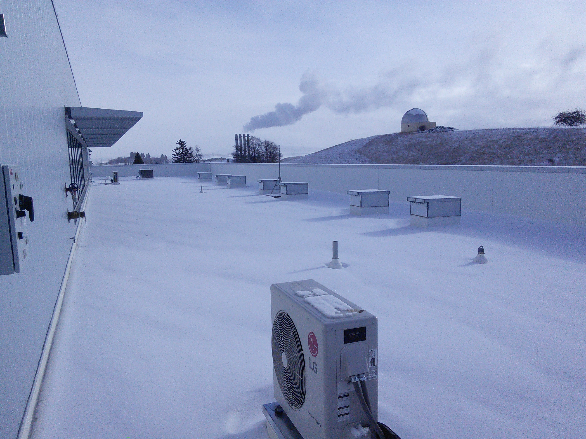
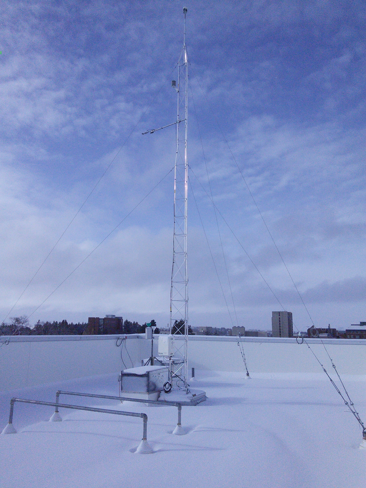
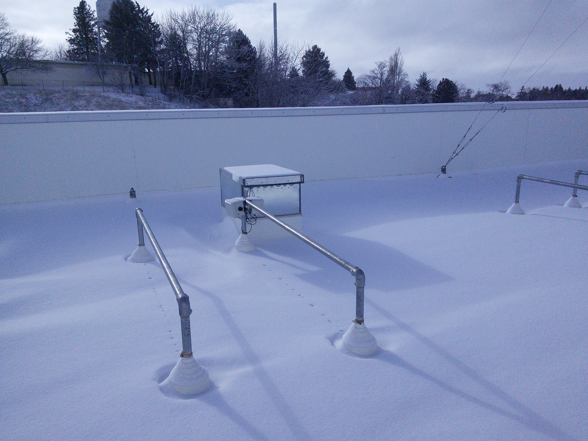
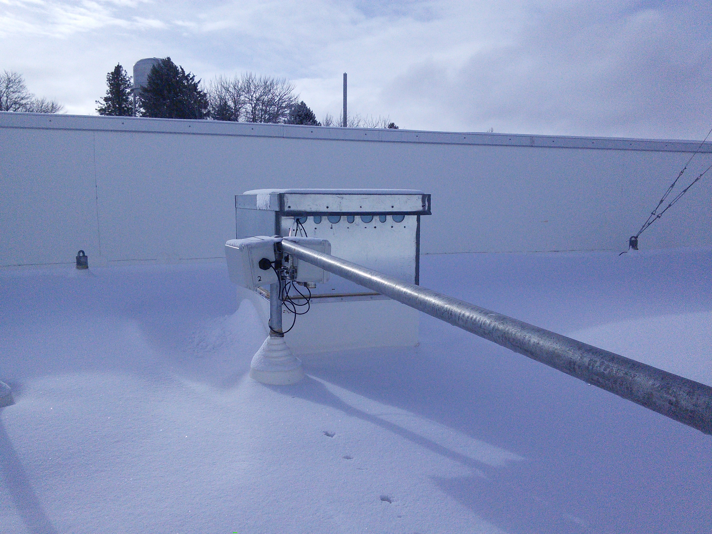
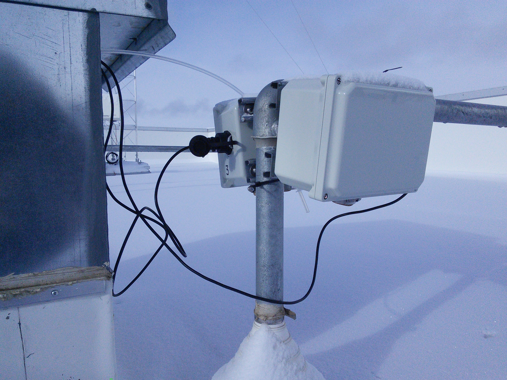
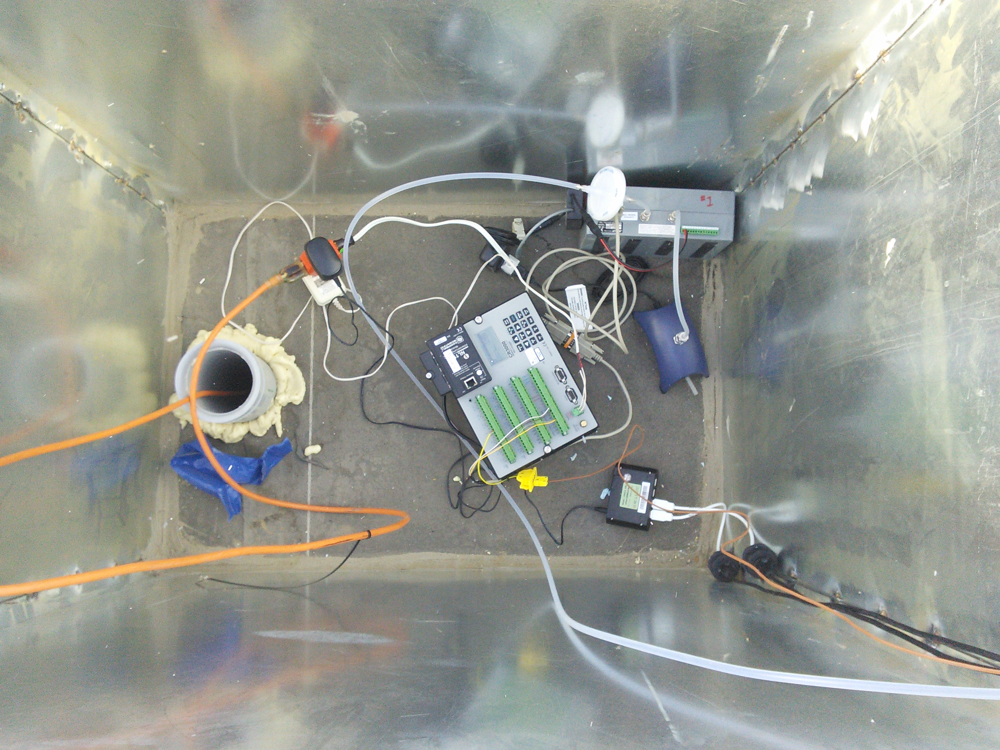

# Roof Test #1

### Urbanova Air Quality Network Sensor Prototype

First outdoor test data set. Data quality is enhanced by simultaneous carbon
dioxide (CO2) measurements made by research-grade gas analyzer
([LI-840A; LICOR Biosciences](https://www.licor.com/env/products/gas_analysis/LI-840A/)).

* Unit 2 has CO2 sensor mounted internally and relies on aerosol sensor to
  provide fresh ambient sample
* Unit 3 exposes the CO2 sensor to ambient conditions through the enclosure wall

## Photos

