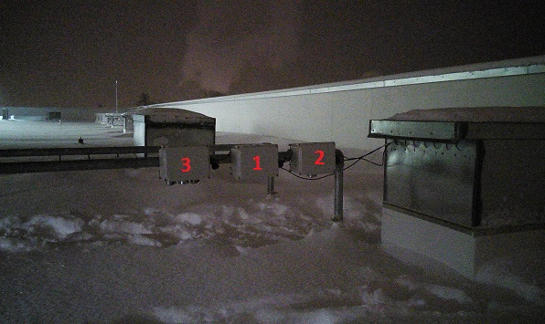
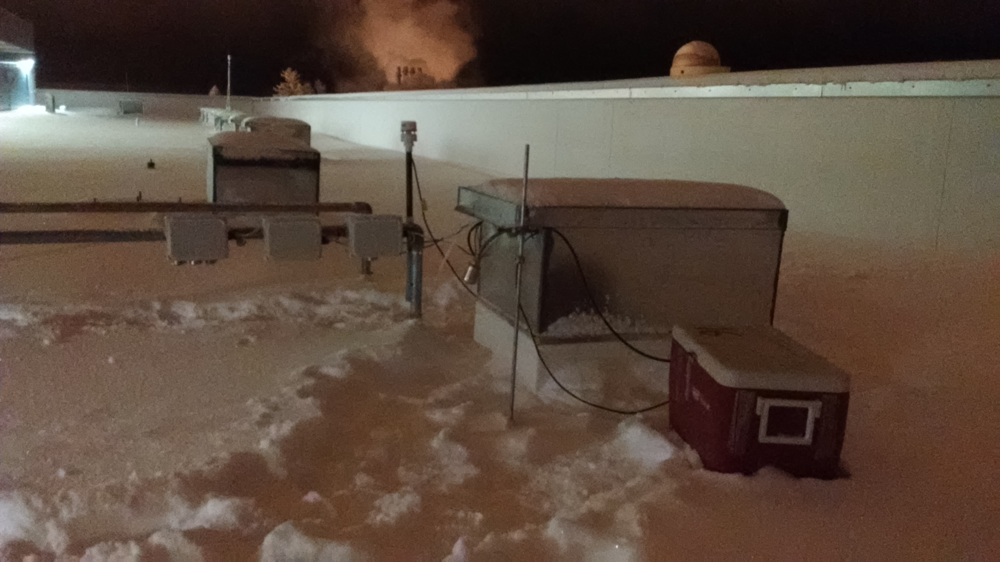
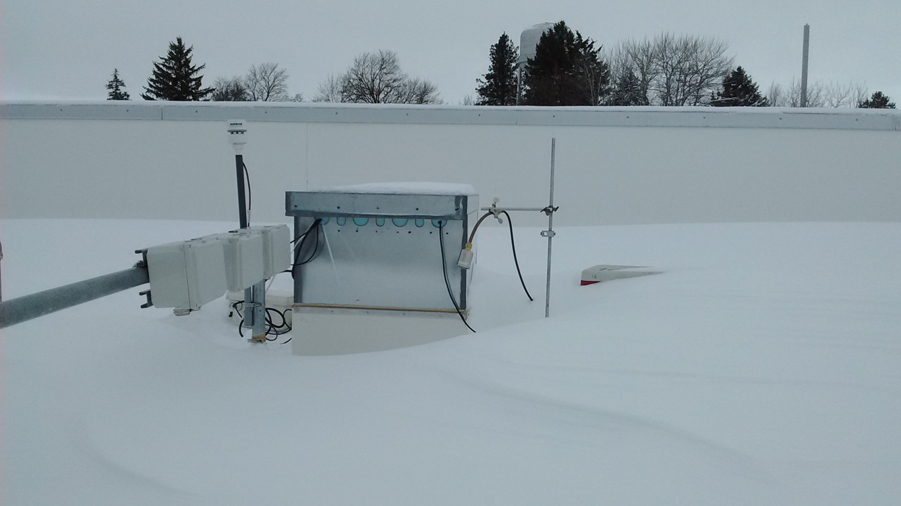
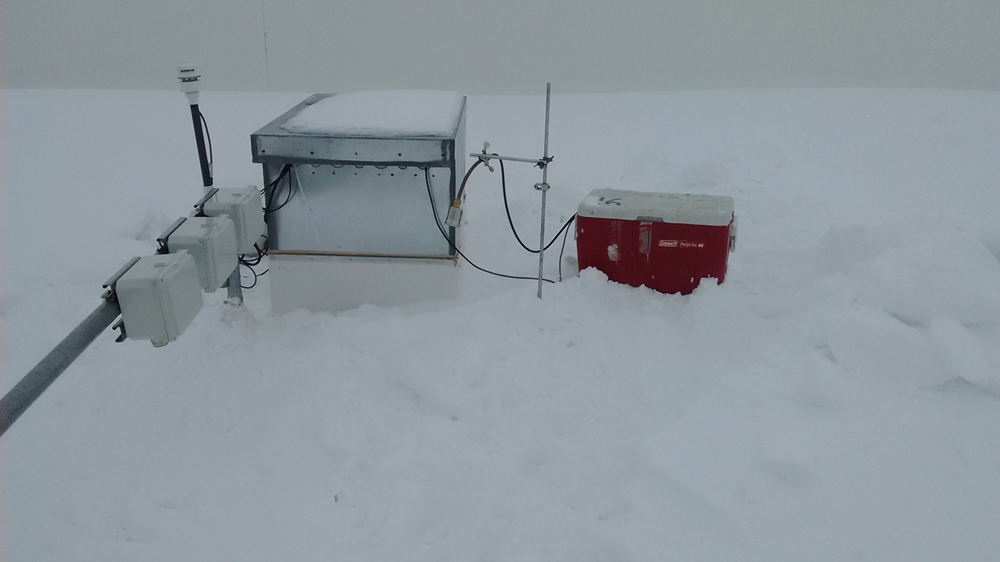
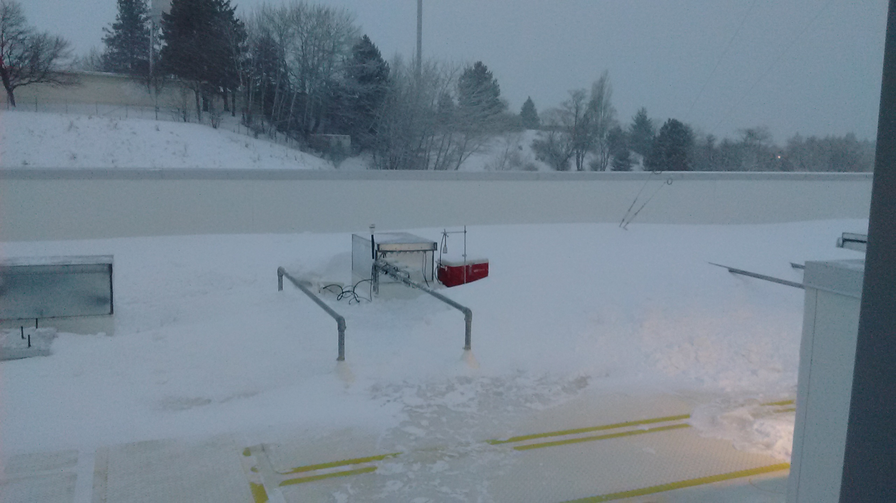
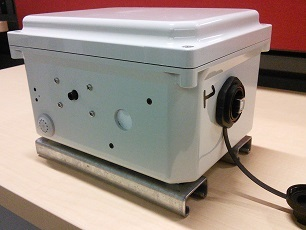
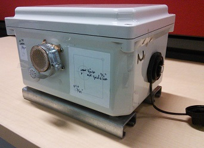
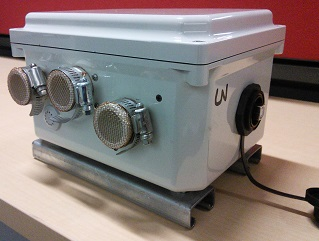

# Roof Test #2

### Urbanova Air Quality Network Sensor Prototype

A more complete outdoor test data set with measurements of:

* carbon dioxide (CO2) via [LI-840A (LICOR Biosciences)](https://www.licor.com/env/products/gas_analysis/LI-840A/)
* fine aerosols (PM2.5) via [DustTrak II (TSI Inc)](http://www.tsi.com/DUSTTRAK-II-Aerosol-Monitor-8530/)
* coarse aerosols (PM10) via DustTrak II (TSI Inc)
* weather conditions (T/P/RH/WS/WD) via [150WX (Airmar Technologies)](http://www.airmartechnology.com/weather-description.html?id=155)

> *N.B. The prototype PM, CO2 and weather data sets are committed as
.zip files to limit overall repository size.*

## Photos

## Other Files

These images are included because they were part of the data access framework
[described in this Gist](https://gist.github.com/patricktokeeffe/85895534418c9a4aa708cacddf421326)

